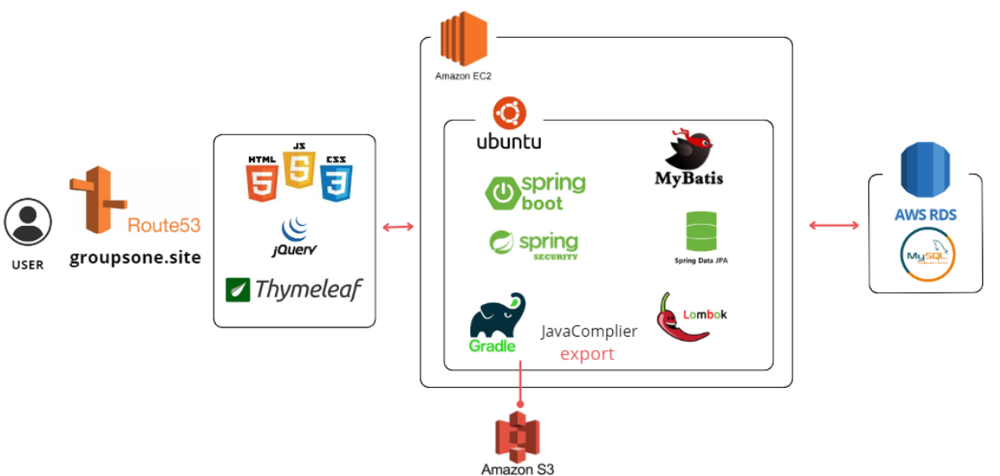
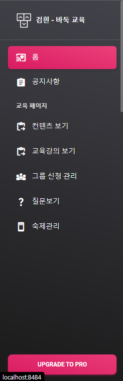
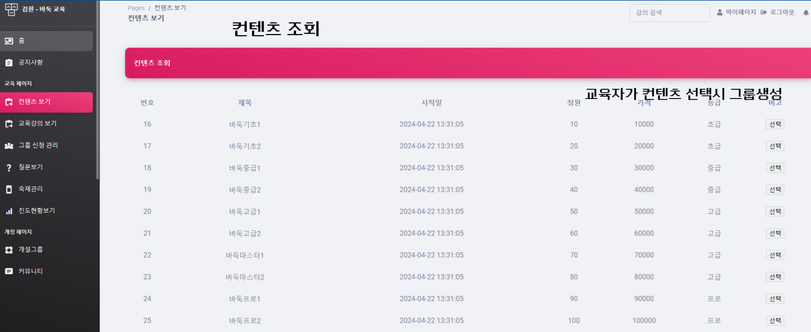
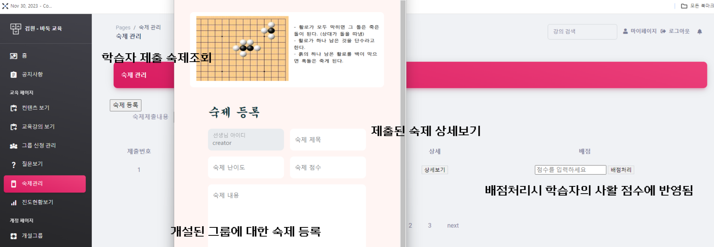
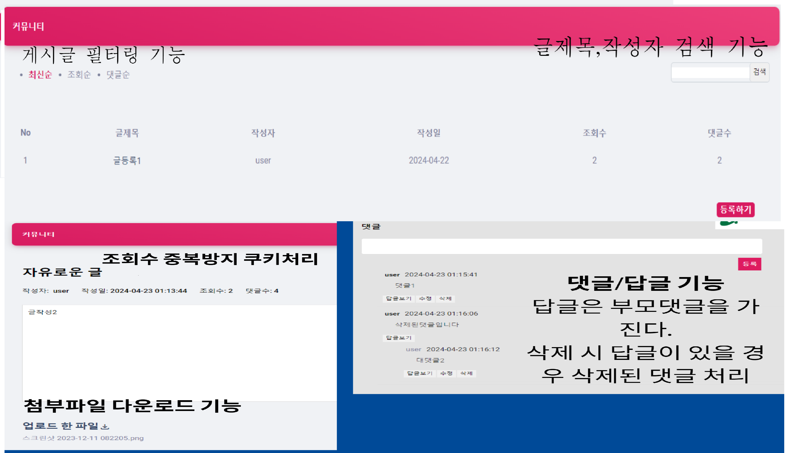
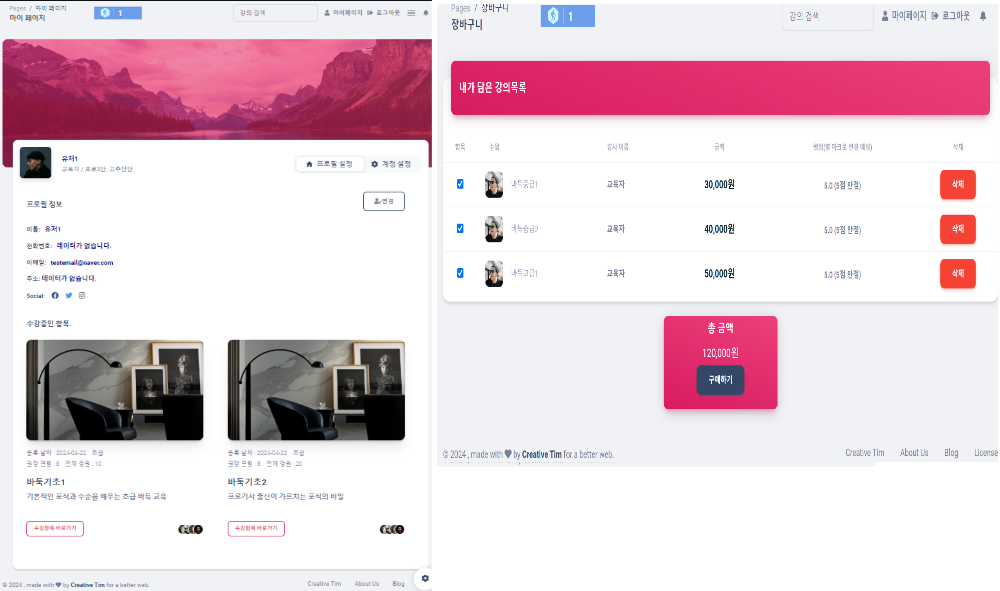
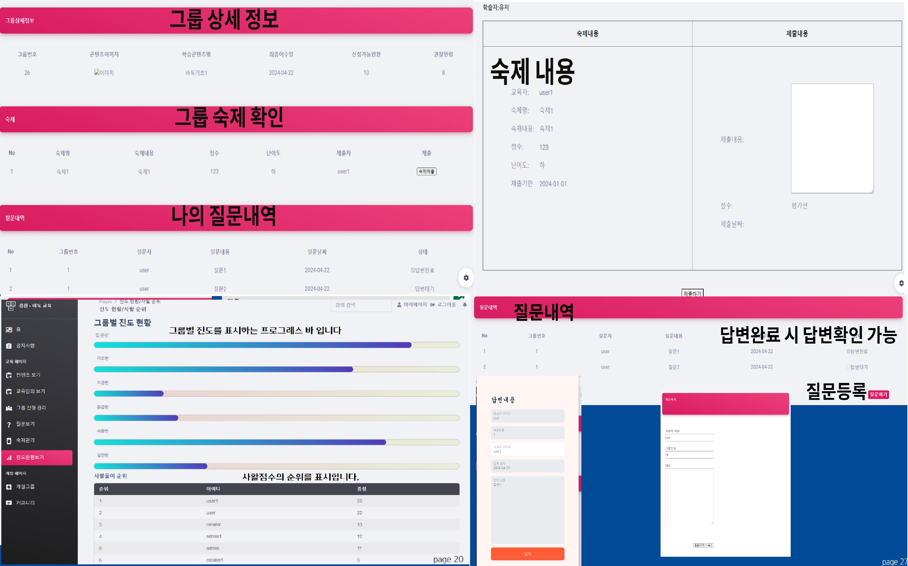
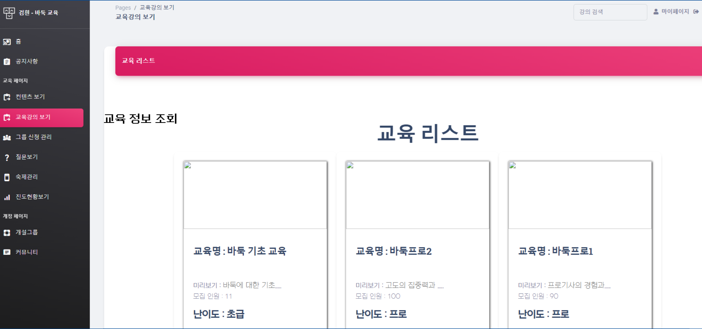
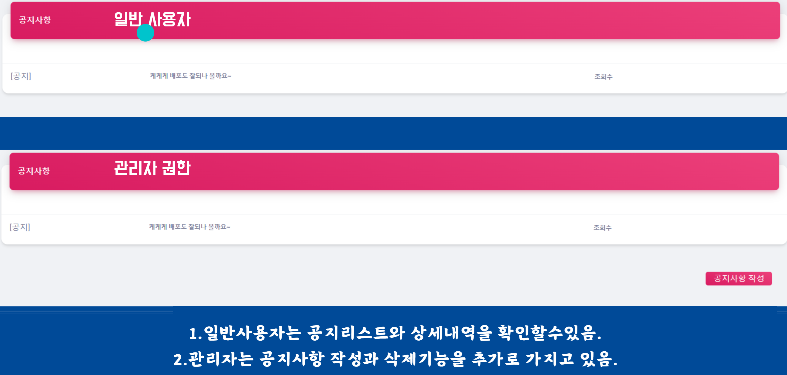

<h1>SpringBoot-Project 바둑교육 플랫폼</h1>

<h3>프로젝트 소개</h3>
“클래스101”과 같이 교육 서비스를 제공하는 플랫폼이지만, 저 연령층의 바둑 교육만을 전문적으로 제공하는 플랫폼입니다. 기존 플랫폼과는 다르게 교육자가 자신의 교육을 등록하여 서비스하는 방식이 아닌, 한국바둑기원에서 제공하는 프로 선수들의 교육 자료를 구매자(교육자)가 학습자에게 제공하는 방식입니다.

<h3>개발 기간</h3>
24.03.27 ~ 04.22
<ul>
  <li>03.27 ~ 03.31 : 설계 (요구사항정의서, 플로우차트, ERD, 스토리보드, 컨벤션정의)</li>
  <li>04.1 ~ 04.07 : UI 설계 및 작업 </li>
  <li>04.8 ~ 04.19 : 기능 구현 </li>
  <li>04.19 ~ 04.22 : 배포 및 오류수정 </li>
</ul>

<h3>멤버구성</h3>
<ul>
  <li>조장 신희섭 - 설계, 깃관리, 회원프로세스, 결제, 메인 페이지 및 강의추천기능, UI/UX 커스터마이징 및 가이드라인 제공</li>
  <li>조원 고현진 - 학습자 프로세스, 커뮤니티</li>
  <li>조원 신주형 - 교육자료등록</li>
  <li>주원 강태혁 - 교육자 프로세스</li>
</ul>

### 기술 스택
- **프로그래밍 언어**:
  - Java 11
  - JavaScript

- **웹 개발**:
  - HTML
  - CSS
  - AJAX
  - jQuery

- **프레임워크 및 라이브러리**:
  - Spring Boot 2.7.5
  - Spring Security
  - Thymeleaf

- **데이터베이스**:
  - MySQL 8.0.36

- **데이터베이스 매핑**:
  - MyBatis

- **버전 관리**:
  - Git
  - GitHub

- **API**:
  - RESTful API

- **클라우드 서비스**:
  - AWS

 
<h3>서비스 아키텍처</h3> 
<!--  -->

 

<h2>모든 유저</h2>
<h3>사이드바(baseLayout)</h3>
<ul>
  <li>클릭한 메뉴탭에 배경색을 유지시키기 위해 로컬 스토리지를 사용</li>
  <li>권한에 따라 보여지는 메뉴탭이 달라짐</li>
</ul>

<h3>메인페이지</h3>
<ul>
  <li>등급 및 등록날짜에 따라 강의 추천하는 필터링 기능</li>
</ul>

<h3>회원가입</h3>
<ul>
  <li>기본값은 일반 user 권한으로 가입됩니다.</li>
  <li>관리자, 교육자는 직접 계정을 생성하여 제공합니다.</li>
</ul>

<h3>로그인</h3>
<ul>
  <li>RESTful API를 사용하여 소셜로그인</li>
  <li>스프링 시큐리티를 사용하여 자동로그인 및 권한처리</li>
</ul>

 

<h2>교육자</h2>
<h3>구매한 교육리스트</h3>
<ul>
  <li>구매한 교육자료를 통해 그룹 개설을 할 수 있음</li>
</ul>

<h3>숙제관리 및 질문답변</h3>
<ul>
  <li>숙제 등록, 학습자 숙제조회, 숙제 상세보기, 배점처리로 학습자의 사활점수 관리</li>
  <li>학습자 질문조회, 답변등록</li>
  <li>숙제등록, 조회, 배점처리, 질문답변 등 처리에 따른 상태변경을 자동으로 처리 및 UI 노출</li>
</ul>

 

<h2>학습자 및 일반회원</h2>
<h3>커뮤니티</h3>
<ul>
  <li>게시글 필터링, 조회수 중복방지를 위한 쿠키처리</li>
  <li>댓글/답글 기능</li>
  <li>파일다운로드 기능 및 파얼 업로드 기능</li>
</ul>

<h3>마이페이지</h3>
<ul>
  <li>수강중인 학습그룹 카드 디자인으로 노출</li>
  <li>프로필 정보 확인 및 변경 기능</li>
  <li>계정 설정을 통해 계정 삭제 및 비활성화 기능</li>
  <li>유저경험을 올리고자 ajax 통신을 이용, 화면 비동기 처리</li>
</ul>
<h3>장바구니</h3>
<ul>
  <li>전체적으로 jQuery & JS 를 이용</li>
  <li>체크된 항목없이 구매할 경우 알림창 노출</li>
  <li>체크항목에 따른 합계된 금액 표시</li>
  <li>결제 API를 사용하여 테스트 결제 가능</li>
  <li>비동기로 처리하여 사용자경험을 상승</li>
</ul>

<h3>강의목록 전체확인 및 강의신청목록 확인</h3>
<ul>
  <li>강의명을 통한 강의조건 검색 기능</li>
  <li>원하는 강의 클릭시 상세보기 기능</li>
  <li>신청한 강의 목록 확인 및 신청취소 기능</li>
</ul>

<h3>강의진행</h3>
<ul>
  <li>진행중인 강의목록 및 상세보기, 숙제확인, 질문내역 한번에 볼 수 있는 페이지</li>
  <li>진도현황 게이지바 형태로 노출</li>
  <li>강의 그룹내 사활점수로 순위를 표시</li>
</ul>

 

<h2>관리자</h2>
<h3>교육자료 등록 및 공지사항</h3>
<ul>
  <li>바둑기원에서 제공한 교육자료를 관리자가 등록하여 교육자가 구매</li>
</ul>

